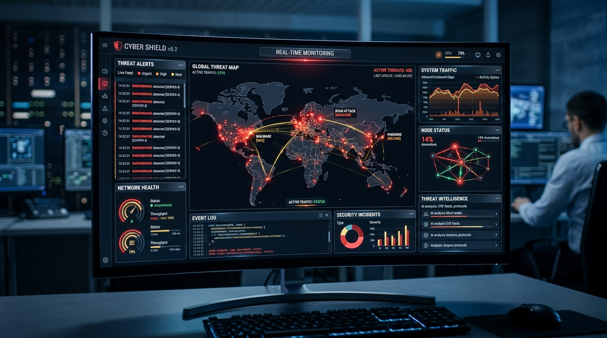

# Muhammad Umair - Personal Portfolio Website

A modern, cinematic, and interactive personal portfolio website for **Muhammad Umair** — Software Engineering Student, Web Developer, and Cybersecurity Enthusiast from Lahore, Pakistan.



## 🎨 Design System & Color Palette

- **Primary (Rudy Red):** `#A81C1C`
- **Secondary (Orange Yellow Crayola):** `#F5B335`
- **Background (Dark Charcoal):** `#0D0D0D`
- **Primary Text:** `#F5F5F5`
- **Secondary Text:** `#B3B3B3`

---

## ⚡ Key Features

1. **Sticky Glass Navigation:** Transparent backdrop blur that shrinks dynamically on scroll.
2. **Hero Section:** Glowing circular frame profile picture with floating animation, animated text reveal, and 3D CTA press interactions.
3. **Three.js 3D Background Canvas:** Interactive particle field and floating wireframe mesh with mouse movement parallax.
4. **Bilingual Support (English & Urdu):** Real-time language switcher with LTR/RTL support and custom Urdu typography (`Noto Nastaliq Urdu`).
5. **Dark / Light Mode:** Built-in theme switch context.
6. **Education Timeline:** Vertical milestone timeline highlighting Matriculation (J.W School), Intermediate (Aspire College), and BS Software Engineering (Superior University).
7. **Technical Skills:** Animated progress bars and 3D card tilt for C++, JavaScript, CSS, MS Excel, Word, and PowerPoint.
8. **Interactive Projects Catalog:** Real-time search bar, category filtering (`All`, `Web Development`, `C++`, `Cybersecurity`), detail view modals, and direct GitHub/Demo buttons.
9. **Validated Contact Form:** Interactive message submission with confetti animations and direct social media links for Lahore, Pakistan.
10. **Resume Preview Modal:** In-browser CV viewer and printable PDF download feature.

---

## 📁 File Structure

```
umair-portfolio/
├── assets/
│   ├── avatar.jpg            # Profile picture
│   ├── cybershield.jpg        # CyberShield project preview
│   ├── cpp_engine.jpg         # C++ Memory Engine preview
│   └── threat_sentinel.jpg    # Network Threat Sentinel preview
├── index.html                 # Main HTML entry point
├── styles.css                 # Custom CSS design tokens & glassmorphism
├── translations.js            # English and Urdu translation dictionary
├── projectsData.js            # Editable projects dataset
├── app.js                     # Main React application & components
└── README.md                  # Instructions & deployment guide
```

---

## 🚀 How to Run Locally

Because this application utilizes browser-native ES Modules and Babel Standalone:

1. Open `index.html` directly in any web browser (Google Chrome, Microsoft Edge, Firefox, Safari).
2. Alternatively, serve with any local HTTP server (e.g. VS Code Live Server, Python `python -m http.server 8000`).

---

## 🛠️ How to Customize Your Content

### 1. Replacing Profile Picture & Project Images
Place your personal photo in `assets/avatar.jpg` and your project screenshots inside `assets/`.

### 2. Updating Project Data
Edit `projectsData.js` to add, edit, or remove projects, change tech stack tags, or update repository URLs:

```javascript
{
  id: "my-new-project",
  title: "Your Project Title",
  category: "Web Development",
  description: "Description of your project...",
  techStack: ["React", "Node.js"],
  image: "assets/your_image.jpg",
  github: "https://github.com/your-username/project",
  demo: "https://your-demo-link.com"
}
```

### 3. Modifying Urdu or English Text
Open `translations.js` to edit any bio details, degree titles, or skills text.

---

## 🌐 Deploying to Vercel / Netlify / GitHub Pages

1. Push your `umair-portfolio` folder to a GitHub repository.
2. Connect your repository to **Vercel** or **Netlify**.
3. Set output directory to `./` (static HTML/JS root).
4. Deploy!
